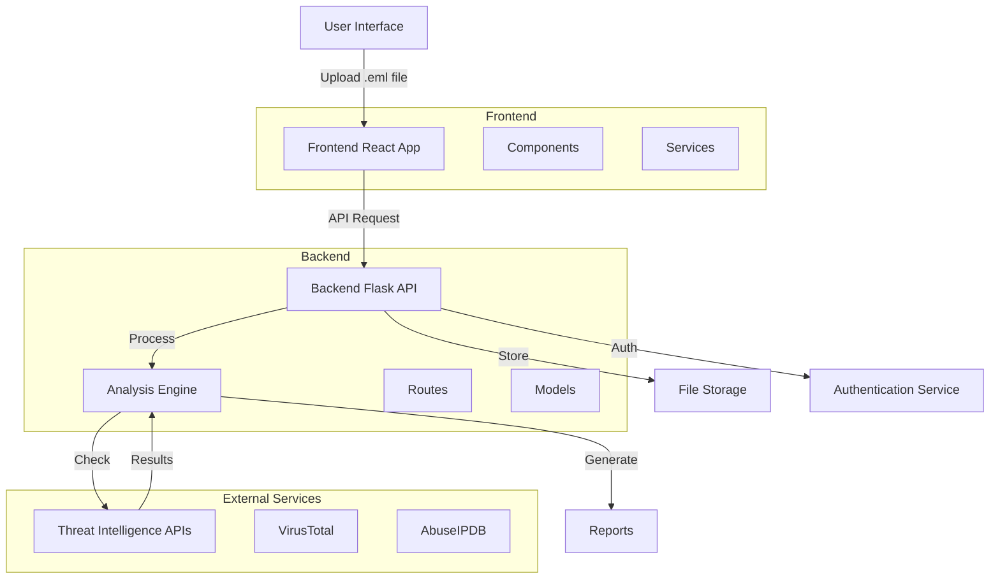
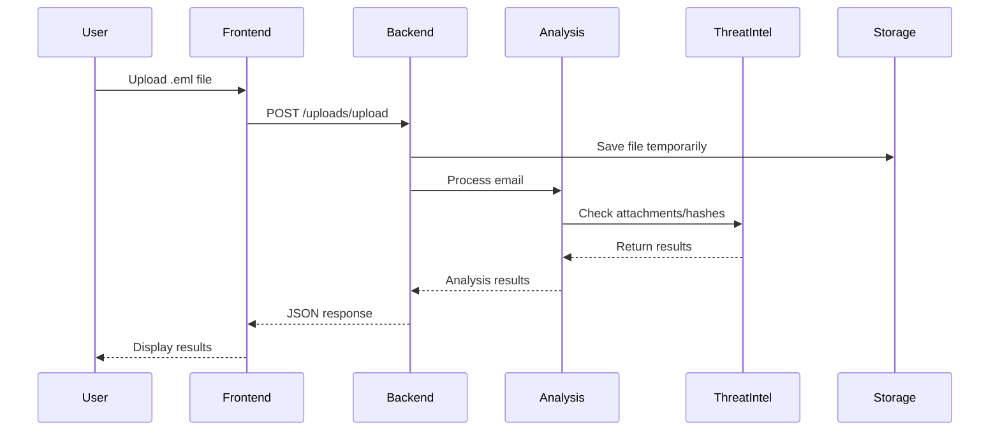
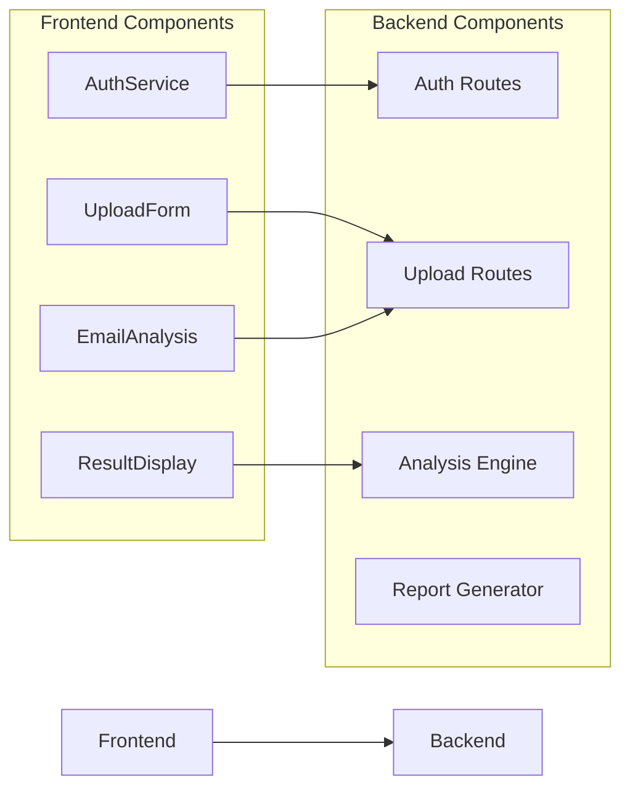

# Email Phishing Detection System Architecture

## System Architecture Diagram



## Data Flow Diagram



## Component Diagram



## Data/Input Description

### 1. Email File (.eml) Structure
```json
{
    "headers": {
        "From": "sender@example.com",
        "To": "recipient@example.com",
        "Subject": "Urgent: Account Verification Required",
        "Date": "2024-03-15T10:30:00Z",
        "Received": [
            {
                "from": "mail.example.com",
                "by": "mx.google.com",
                "with": "ESMTP",
                "id": "123456789"
            }
        ]
    },
    "body": {
        "text": "Please click the link below to verify your account...",
        "html": "<html>...</html>"
    },
    "attachments": [
        {
            "filename": "document.pdf",
            "content_type": "application/pdf",
            "size": 1024
        }
    ]
}
```

### 2. Analysis Results Structure
```json
{
    "analysis": {
        "risk_assessment": {
            "score": 75,
            "level": "high",
            "factors": [
                "suspicious_links",
                "spf_failure",
                "malicious_attachment"
            ]
        },
        "authentication": {
            "spf": {
                "result": "fail",
                "status": "error"
            },
            "dkim": {
                "result": false,
                "status": "error"
            },
            "dmarc": {
                "result": "unknown",
                "status": "error"
            }
        },
        "headers": {
            "server_hops": [
                {
                    "ip": "192.168.1.1",
                    "hostname": "mail.example.com",
                    "timestamp": "2024-03-15T10:30:00Z"
                }
            ],
            "suspicious_headers": [
                "X-Mailer: Unknown",
                "Return-Path: <bounce@example.com>"
            ]
        },
        "attachments": {
            "count": 1,
            "details": [
                {
                    "filename": "document.pdf",
                    "hash": "sha256:abc123...",
                    "virustotal": {
                        "detections": 5,
                        "total": 70,
                        "result": "malicious"
                    }
                }
            ]
        },
        "links": {
            "count": 2,
            "details": [
                {
                    "url": "https://example.com/verify",
                    "domain": "example.com",
                    "risk": "high",
                    "reasons": [
                        "url_shortener",
                        "suspicious_domain"
                    ]
                }
            ]
        },
        "content": {
            "language": "en",
            "suspicious_patterns": [
                "urgency",
                "threat",
                "account_verification"
            ]
        }
    }
}
```

### 3. User Authentication Data
```json
{
    "user": {
        "id": "user123",
        "email": "user@example.com",
        "created_at": "2024-03-15T10:30:00Z",
        "last_login": "2024-03-15T10:30:00Z"
    },
    "auth": {
        "token": "jwt_token_here",
        "expires": "2024-03-15T11:30:00Z"
    }
}
```

### 4. Report Generation Data
```json
{
    "report": {
        "metadata": {
            "generated_at": "2024-03-15T10:30:00Z",
            "analyzed_file": "suspicious_email.eml",
            "report_id": "report123"
        },
        "summary": {
            "risk_score": 75,
            "risk_level": "high",
            "key_findings": [
                "SPF authentication failed",
                "Malicious attachment detected",
                "Suspicious links found"
            ]
        },
        "details": {
            "authentication": {...},
            "attachments": {...},
            "links": {...},
            "content": {...}
        }
    }
}
```

## Key Data Flows

1. **Email Upload Flow**
   - User selects .eml file
   - Frontend validates file type
   - Backend receives file and stores temporarily
   - Analysis engine processes the email
   - Results are returned to frontend

2. **Analysis Flow**
   - Parse email headers
   - Extract attachments and generate hashes
   - Check SPF/DKIM/DMARC records
   - Analyze content for suspicious patterns
   - Check links against threat databases
   - Generate risk score

3. **Report Generation Flow**
   - Collect analysis results
   - Format data for PDF/CSV
   - Generate report with findings
   - Provide download link to user

4. **Authentication Flow**
   - User credentials validation
   - JWT token generation
   - Session management
   - Access control enforcement 