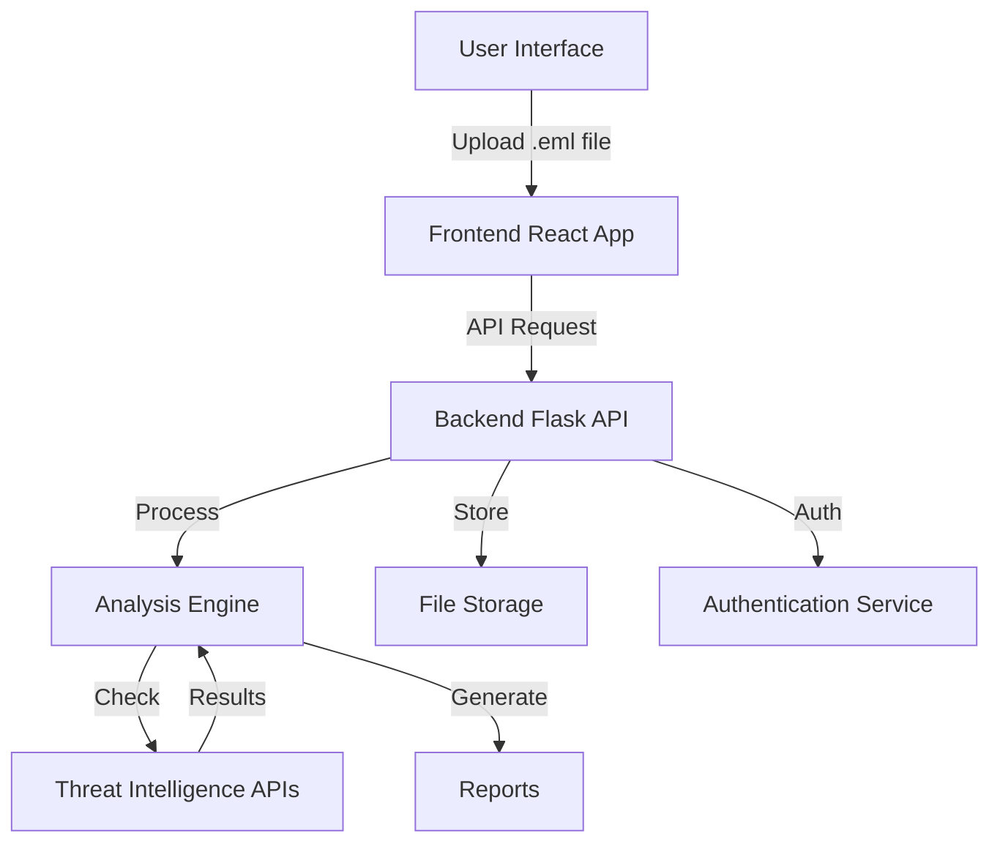
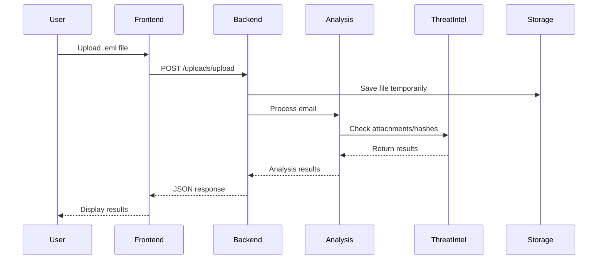
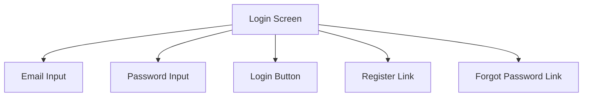
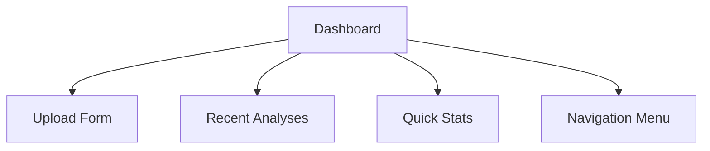
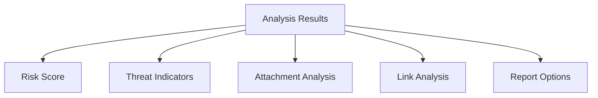

# Email Phishing Detection System - Requirements Specification

## Cover Page
Project Name: Email Phishing Detection and Analysis System
Author: [Your Name]
Program: Software Engineering
Project Organization: GCU
Instructor Name: [Instructor's Name]
Document Revision Number: v1.0
Date: [Current Date]

## Abstract
This project aims to develop a comprehensive email phishing detection and analysis system that helps organizations identify and prevent phishing attacks. The system will provide a user-friendly interface for analyzing suspicious emails, automated detection of phishing indicators, and detailed reporting capabilities. The application will be built using modern web technologies with a focus on security, accuracy, and ease of use.

The system will analyze emails for various phishing indicators including suspicious links, malicious attachments, and authentication failures. It will integrate with threat intelligence services to provide real-time analysis of potential threats. Users will be able to upload email files, view detailed analysis results, and generate comprehensive reports. The project will be developed using a secure, scalable architecture that ensures data privacy and system reliability.

## History and Sign-Off Sheet
Date | Decision/Change Made | Approved By | Comments
-----|---------------------|-------------|----------
[Date] | Initial Requirements | [Instructor's Name] | Initial approval
[Date] | UI Design Review | [Instructor's Name] | Feedback incorporated
[Date] | Technical Requirements Update | [Instructor's Name] | Updated based on feedback
[Date] | Security Requirements Review | [Instructor's Name] | Security matrix approved

## Table of Contents
1. Cover Page
2. Abstract
3. History and Sign-Off Sheet
4. Table of Contents
5. Functional Requirements
6. Non-Functional Requirements
7. Technical Requirements
8. Logical System Design
9. User Interface Design
10. Reports Design

## Functional Requirements

### User Stories

#### Authentication
1. As a user, I want to register an account so that I can access the system securely.
2. As a user, I want to log in to my account so that I can access my analysis history.
3. As a user, I want to reset my password so that I can regain access if I forget it.

#### Email Analysis
4. As a user, I want to upload .eml files so that I can analyze them for phishing attempts.
5. As a user, I want to view analysis results so that I can understand potential threats.
6. As a user, I want to see risk scores so that I can quickly assess email safety.
7. As a user, I want to view detailed analysis of attachments so that I can identify malicious files.
8. As a user, I want to check link safety so that I can avoid dangerous websites.

#### Reporting
9. As a user, I want to generate PDF reports so that I can share analysis results.
10. As a user, I want to export analysis data to CSV so that I can perform further analysis.

#### Administration
11. As an admin, I want to manage user accounts so that I can maintain system security.
12. As an admin, I want to view system usage statistics so that I can monitor performance.

### Functional Requirements - User Stories Taken Out of Scope
User Story ID | User Story | Approval Date | Justification
-------------|------------|---------------|--------------
N/A | N/A | N/A | N/A

## Non-Functional Requirements

### Performance
1. As a user, I want the system to analyze emails within 30 seconds so that I can get quick results.
2. As a user, I want the system to handle files up to 25MB so that I can analyze large emails.

### Security
3. As a user, I want my data to be encrypted so that my information remains secure.
4. As a user, I want secure authentication so that only authorized users can access the system.

### Reliability
5. As a user, I want the system to be available 99.9% of the time so that I can use it when needed.
6. As a user, I want the system to handle errors gracefully so that I don't lose my work.

### Usability
7. As a user, I want an intuitive interface so that I can use the system without training.
8. As a user, I want clear error messages so that I can understand and fix issues.

### Non-Functional Requirements - User Stories Taken Out of Scope
User Story ID | User Story | Approval Date | Justification
-------------|------------|---------------|--------------
N/A | N/A | N/A | N/A

## Technical Requirements

### Frontend
- React.js (v18.2.0)
- Material-UI (v5.15.10)
- Axios (v1.6.7)
- React Router (v6.22.1)

### Backend
- Python (v3.12)
- Flask (v2.3.3)
- Flask-JWT-Extended (v4.6.0)
- Flask-CORS (v4.0.0)

### Analysis Tools
- pyspf (v2.0.14)
- dkimpy (v1.0.5)
- dmarc (v1.0.0)
- beautifulsoup4 (v4.9.3)
- python-magic (v0.4.27)

### External Services
- VirusTotal API
- AbuseIPDB API

### Technical Requirements Taken Out of Scope
Technology or Tool | Approval Date | Justification
------------------|---------------|--------------
N/A | N/A | N/A

## Logical System Design

### System Architecture

### Data Flow

## User Interface Design

### Login Screen

### Dashboard

### Analysis Results

## Reports Design

### PDF Report Structure
1. Header
   - Report title
   - Generation date
   - Analysis ID

2. Summary
   - Risk score
   - Overall assessment
   - Key findings

3. Detailed Analysis
   - Authentication results
   - Attachment analysis
   - Link analysis
   - Content analysis

4. Recommendations
   - Security suggestions
   - Best practices

### CSV Export Structure
- Email metadata
- Risk scores
- Threat indicators
- Analysis timestamps
- User information 