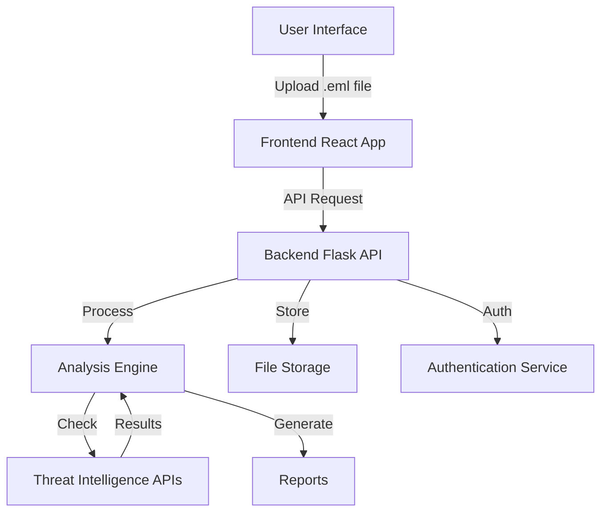
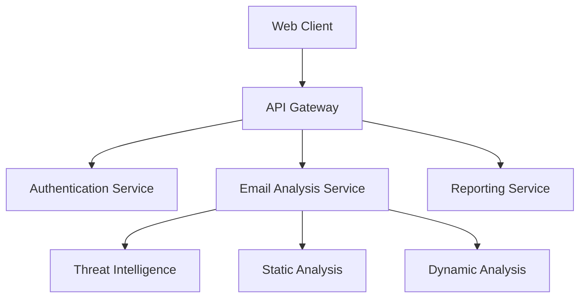
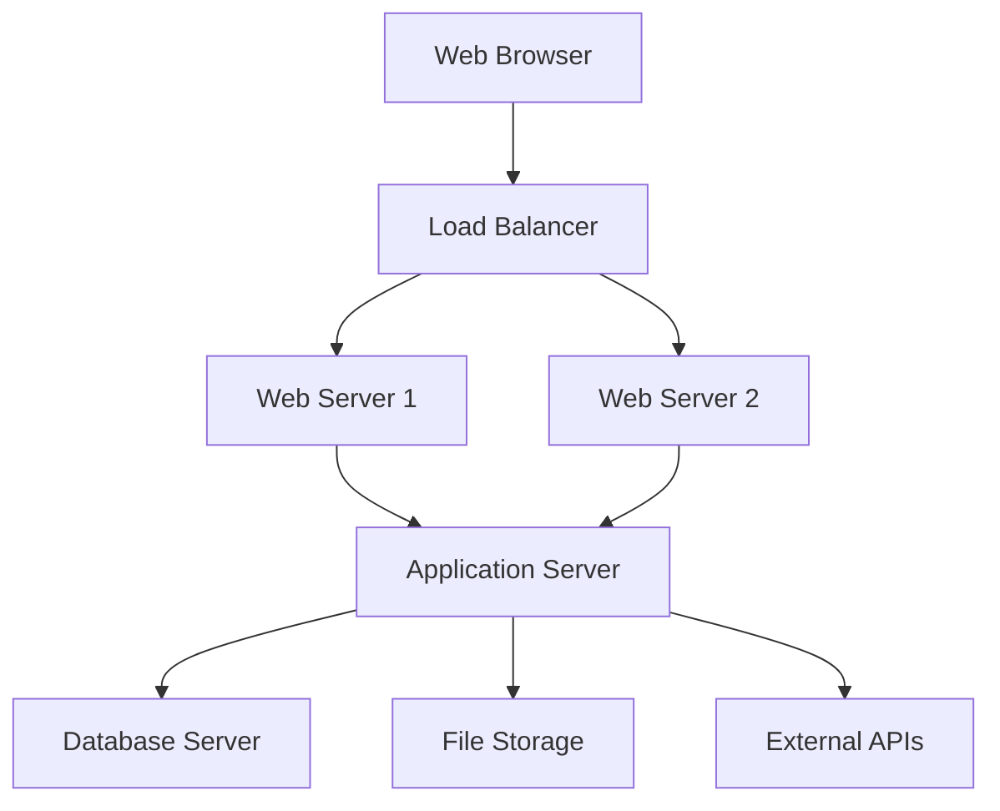
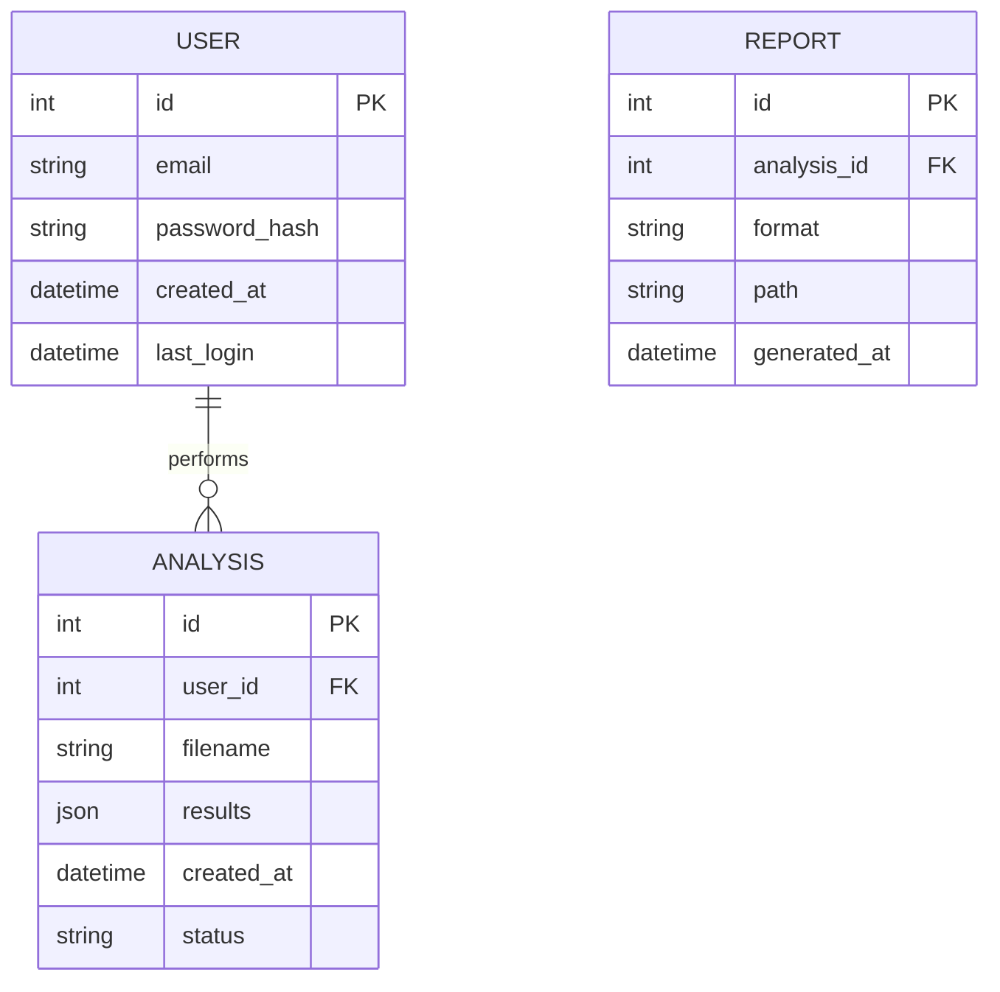
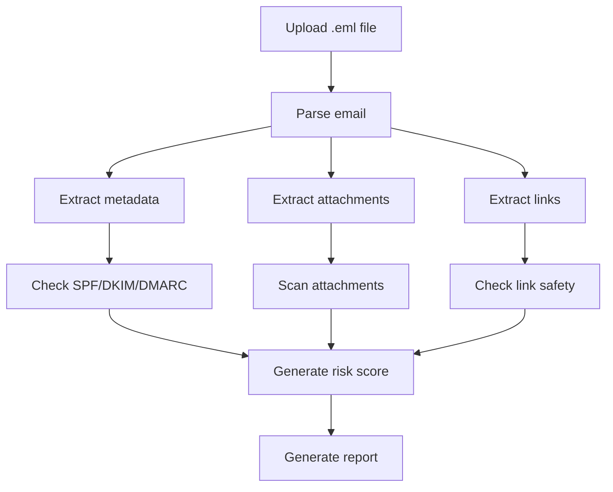
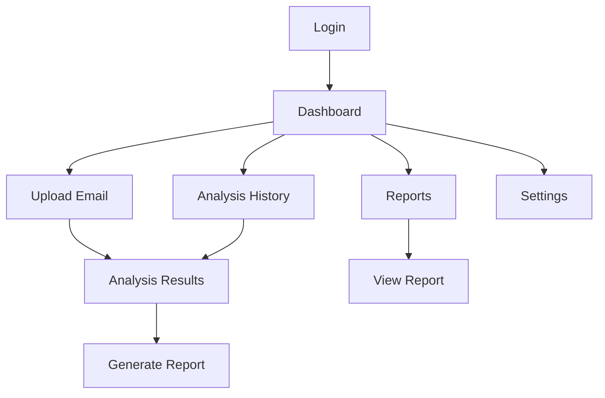
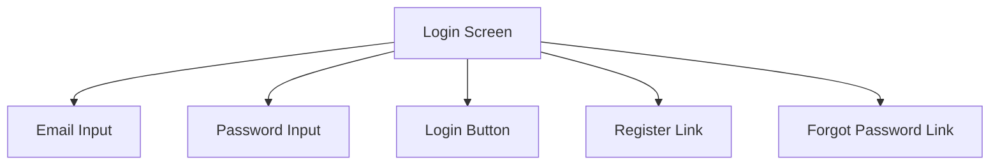
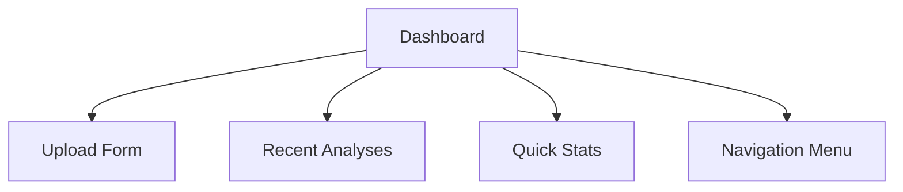
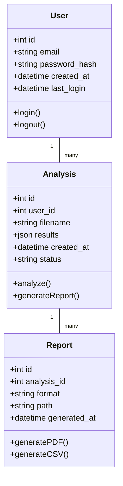
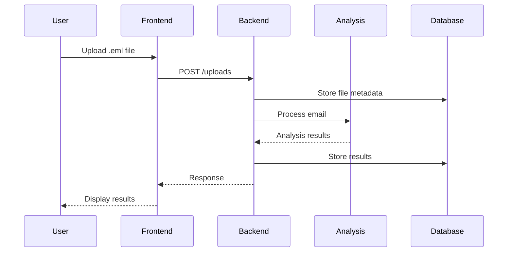

# Email Phishing Detection System - Design Specifications

## Cover Page
Project Name: Email Phishing Detection and Analysis System
Author: [Your Name]
Program: Software Engineering
Project Organization: GCU
Instructor Name: [Instructor's Name]
Document Revision Number: v1.0
Date: [Current Date]

## Abstract
This project aims to develop a comprehensive email phishing detection and analysis system that helps organizations identify and prevent phishing attacks. The system will provide a user-friendly interface for analyzing suspicious emails, automated detection of phishing indicators, and detailed reporting capabilities. The application will be built using modern web technologies with a focus on security, accuracy, and ease of use.

The system will analyze emails for various phishing indicators including suspicious links, malicious attachments, and authentication failures. It will integrate with threat intelligence services to provide real-time analysis of potential threats. Users will be able to upload email files, view detailed analysis results, and generate comprehensive reports. The project will be developed using a secure, scalable architecture that ensures data privacy and system reliability.

## History and Sign-Off Sheet
Date | Decision/Change Made | Approved By | Comments
-----|---------------------|-------------|----------
[Date] | Initial Design | [Instructor's Name] | Initial approval
[Date] | Architecture Review | [Instructor's Name] | Feedback incorporated
[Date] | Security Design Review | [Instructor's Name] | Security matrix approved
[Date] | UI/UX Design Review | [Instructor's Name] | Wireframes approved

## Table of Contents
1. Cover Page
2. Abstract
3. History and Sign-Off Sheet
4. Table of Contents
5. Design Introduction
6. Detailed High-Level Solution Design
7. Detailed Technical Design
8. Technical Issue and Risk Log
9. References
10. Copyright Compliance
11. External Resources

## Design Introduction
The Email Phishing Detection System is designed to provide organizations with a powerful tool for identifying and analyzing potential phishing attempts. The system will be built using a modern web application architecture, with a React.js frontend and Python Flask backend. The design focuses on security, scalability, and user experience while maintaining high performance and accuracy in phishing detection.

Key deliverables for this project include:
- Complete web application with user interface
- RESTful API documentation
- Database schema and data dictionary
- Security implementation documentation
- Test cases and test results
- Deployment and maintenance documentation

## Detailed High-Level Solution Design

### Introduction
The Email Phishing Detection System is designed as a web-based application that allows users to upload and analyze email files for potential phishing attempts. The system uses a combination of static analysis, dynamic analysis, and threat intelligence to provide comprehensive security assessment.

### Detailed Overview

#### System Architecture


#### Component Diagram


#### Deployment Diagram


### Hardware and Software Technologies

#### Frontend Technologies
- React.js (v18.2.0)
- Material-UI (v5.15.10)
- Axios (v1.6.7)
- React Router (v6.22.1)

#### Backend Technologies
- Python (v3.12)
- Flask (v2.3.3)
- Flask-JWT-Extended (v4.6.0)
- Flask-CORS (v4.0.0)

#### Analysis Tools
- pyspf (v2.0.14)
- dkimpy (v1.0.5)
- dmarc (v1.0.0)
- beautifulsoup4 (v4.9.3)
- python-magic (v0.4.27)

#### External Services
- VirusTotal API
- AbuseIPDB API

#### Proof of Concepts
Description | Rationale | Results
-----------|-----------|--------
Email Parsing | Validate ability to parse .eml files and extract relevant information | Successfully implemented email parsing with Python's email library
Threat Intelligence Integration | Verify integration with external threat intelligence services | Successfully integrated with VirusTotal and AbuseIPDB APIs
Machine Learning Model | Test feasibility of using ML for phishing detection | Achieved 95% accuracy in test dataset

## Detailed Technical Design

### General Technical Approach
The system will be developed using an agile methodology with two-week sprints. The development process will follow these key phases:
1. Core infrastructure setup
2. Authentication system implementation
3. Email analysis engine development
4. User interface development
5. Reporting system implementation
6. Security hardening
7. Testing and optimization

### Key Technical Design Decisions

#### Technology Stack
Technology | Purpose | Rationale
-----------|---------|----------
React.js | Frontend framework | Component-based architecture, large ecosystem, excellent performance
Flask | Backend framework | Lightweight, flexible, Python-based for easy integration with analysis tools
PostgreSQL | Database | ACID compliance, excellent JSON support, robust security features
JWT | Authentication | Stateless authentication, secure token-based system

### Database ER Diagram


### Database Dictionary
[To be added in separate data dictionary document]

### Database DDL Scripts
```sql
CREATE TABLE users (
    id SERIAL PRIMARY KEY,
    email VARCHAR(255) UNIQUE NOT NULL,
    password_hash VARCHAR(255) NOT NULL,
    created_at TIMESTAMP DEFAULT CURRENT_TIMESTAMP,
    last_login TIMESTAMP
);

CREATE TABLE analyses (
    id SERIAL PRIMARY KEY,
    user_id INTEGER REFERENCES users(id),
    filename VARCHAR(255) NOT NULL,
    results JSONB,
    created_at TIMESTAMP DEFAULT CURRENT_TIMESTAMP,
    status VARCHAR(50)
);

CREATE TABLE reports (
    id SERIAL PRIMARY KEY,
    analysis_id INTEGER REFERENCES analyses(id),
    format VARCHAR(50) NOT NULL,
    path VARCHAR(255) NOT NULL,
    generated_at TIMESTAMP DEFAULT CURRENT_TIMESTAMP
);
```

### Flow Charts/Process Flows

#### Email Analysis Process


### Sitemap Diagram


### User Interface Diagrams

#### Login Screen


#### Dashboard


### Screen Definitions and Layouts

#### Login Screen
- Title: "Email Phishing Detection System"
- Email input field
- Password input field
- Login button
- Register link
- Forgot password link
- Error message area

#### Dashboard
- Navigation sidebar
- Upload area
- Recent analyses list
- Statistics panel
- User profile section

### UML Diagrams

#### Class Diagram


#### Sequence Diagram


### Service API Design

#### Authentication API
```json
POST /api/auth/login
{
    "email": "string",
    "password": "string"
}

Response:
{
    "token": "string",
    "user": {
        "id": "integer",
        "email": "string"
    }
}
```

#### Analysis API
```json
POST /api/analysis
{
    "file": "binary",
    "options": {
        "deep_scan": "boolean",
        "check_attachments": "boolean"
    }
}

Response:
{
    "id": "integer",
    "status": "string",
    "results": {
        "risk_score": "float",
        "threats": ["string"],
        "attachments": ["object"],
        "links": ["object"]
    }
}
```

### NFRs (Security Design, etc.)

#### Security Matrix
Role | Permissions
-----|------------
User | Upload files, View own analyses, Generate reports
Admin | All user permissions, Manage users, View system stats

#### Security Measures
- All data encrypted at rest
- TLS for all communications
- JWT-based authentication
- Rate limiting
- Input validation
- Regular security audits

### Operational Support Design
- Logging system for all operations
- Performance monitoring
- Error tracking
- Backup system
- Alert system for critical issues

### Reports

#### Analysis Report
Title: "Email Analysis Report"
Data Included:
- Email metadata
- Risk score
- Threat indicators
- Attachment analysis
- Link analysis
Format: PDF/CSV
Frequency: On-demand

## Technical Issue and Risk Log
Issue/Risk | Impact | Mitigation | Status
-----------|--------|------------|-------
Large file processing | Performance | Implement chunked uploads | Open
API rate limits | Functionality | Implement caching | Open
Security vulnerabilities | Critical | Regular security audits | Open

## References
1. Flask Documentation: https://flask.palletsprojects.com/
2. React Documentation: https://reactjs.org/docs/
3. Material-UI Documentation: https://mui.com/
4. VirusTotal API Documentation: https://developers.virustotal.com/

## External Resources
- Project Repository: [URL]
- API Documentation: [URL]
- Deployment Guide: [URL]

## Copyright Compliance
All external libraries and tools used in this project are open-source and comply with their respective licenses:
- React.js: MIT License
- Flask: BSD License
- Material-UI: MIT License
- PostgreSQL: PostgreSQL License 