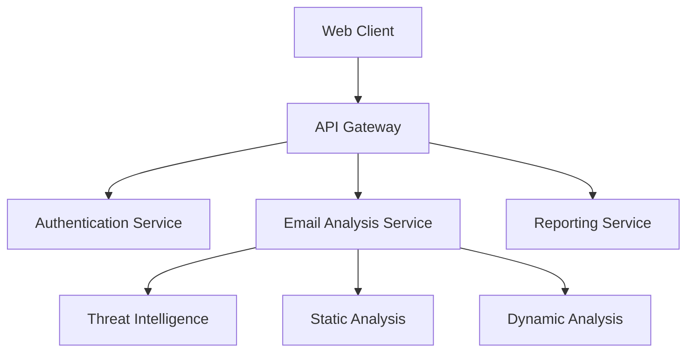
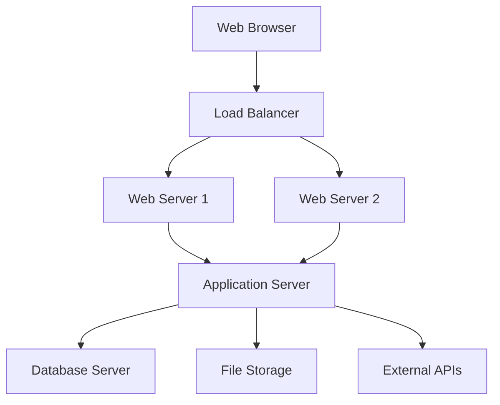
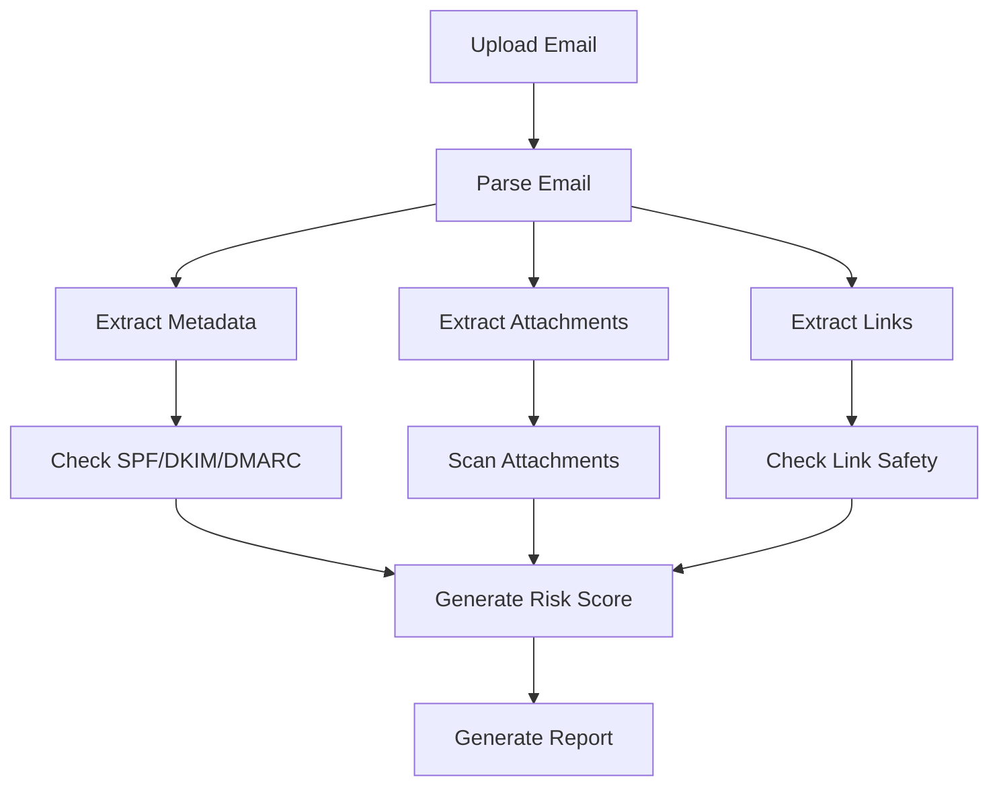
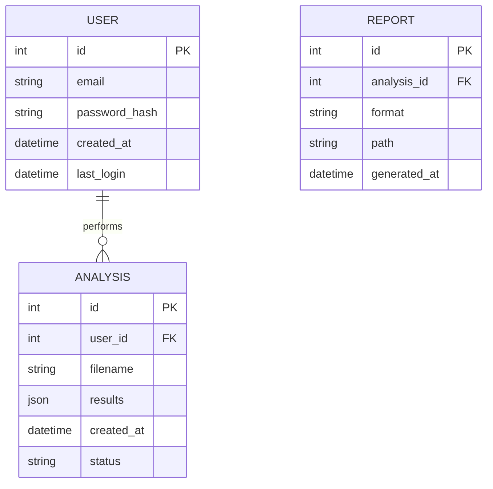
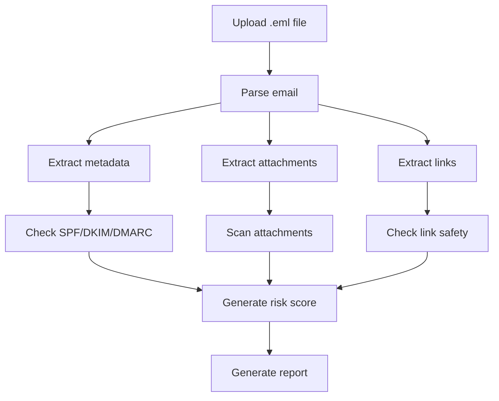
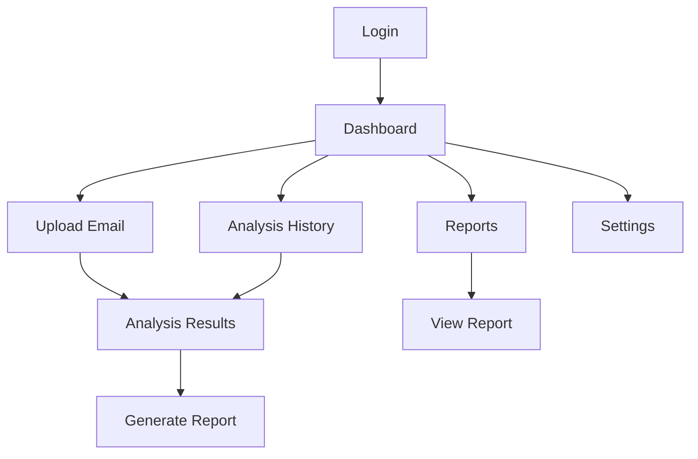
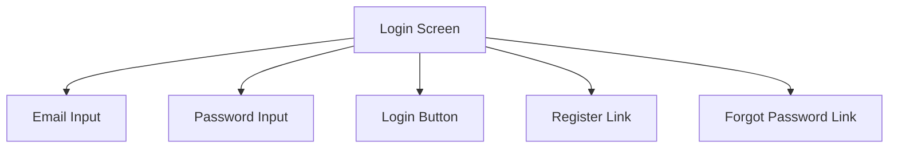
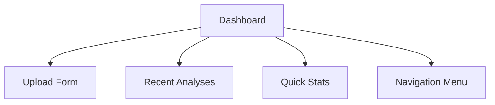

# Email Phishing Detection System - Design Specifications

## Cover Page
Project Name: Email Phishing Detection and Analysis System
Author: [Your Name]
Program: Software Engineering
Project Organization: GCU
Instructor Name: [Instructor's Name]
Document Revision Number: v1.0
Date: [Current Date]

## Abstract
The Email Phishing Detection System is designed to provide organizations with a powerful tool for identifying and analyzing potential phishing attempts in email communications. This system leverages advanced analysis techniques, including SPF/DKIM/DMARC verification, attachment scanning, and link analysis to detect and prevent phishing attacks. The purpose of this project is to create a secure, efficient, and user-friendly platform that allows for real-time email analysis, threat detection, and comprehensive reporting. The project involves developing a React.js frontend, Python Flask backend, and integrating with threat intelligence services to provide a complete phishing detection solution.

## History and Sign-Off Sheet
Version | Date | Author | Description | Sign-Off
--------|------|--------|-------------|---------
1.0 | [Date] | [Your Name] | Initial Design Document | [Instructor Name]

## Table of Contents
1. Cover Page
2. Abstract
3. History and Sign-Off Sheet
4. Table of Contents
5. Design Introduction
6. Detailed High-Level Solution Design
7. Detailed Technical Design
8. Technical Issue and Risk Log
9. References
10. Copyright Compliance
11. External Resources

## Design Introduction
The Email Phishing Detection System aims to address the growing threat of phishing attacks by providing organizations with a comprehensive tool for email analysis and threat detection. The system will analyze emails for various phishing indicators and provide detailed reports on potential threats. Key functionalities include:

- Email Authentication Verification: SPF, DKIM, and DMARC checks
- Attachment Analysis: Scanning for malicious content
- Link Safety Analysis: Checking URLs against threat databases
- Risk Scoring: Comprehensive threat assessment
- Detailed Reporting: PDF and CSV export capabilities
- User Management: Role-based access control

Project Deliverables:
- Complete web application with user interface
- API Documentation
- UML Diagrams (Component, Class, Deployment, Sequence, and Activity Diagrams)
- Security Matrices and Workflow Diagrams
- Test Cases and Results

## Detailed High-Level Solution Design

### Introduction
The Email Phishing Detection System is designed as a web-based application that allows users to upload and analyze email files for potential phishing attempts. The system uses a combination of static analysis, dynamic analysis, and threat intelligence to provide comprehensive security assessment.

### Detailed Overview
The proposed design follows a modular architecture with interconnected components that interact seamlessly to provide real-time email analysis, threat detection, and reporting. The key components include:

- Frontend React Application: User interface for email upload and analysis
- Flask Backend API: Processes requests and manages analysis
- Analysis Engine: Performs email authentication, attachment, and link analysis
- Threat Intelligence Integration: VirusTotal and AbuseIPDB APIs
- Database: Stores user data and analysis results
- Reporting System: Generates PDF and CSV reports

### Logical and Physical Solution Designs

#### Component Diagram


#### Deployment Diagram


#### Activity Diagram


### Hardware and Software Technologies

#### Frontend Technologies
- React.js (v18.2.0)
- Material-UI (v5.15.10)
- Axios (v1.6.7)
- React Router (v6.22.1)

#### Backend Technologies
- Python (v3.12)
- Flask (v2.3.3)
- Flask-JWT-Extended (v4.6.0)
- Flask-CORS (v4.0.0)

#### Analysis Tools
- pyspf (v2.0.14)
- dkimpy (v1.0.5)
- dmarc (v1.0.0)
- beautifulsoup4 (v4.9.3)
- python-magic (v0.4.27)

#### External Services
- VirusTotal API
- AbuseIPDB API

#### Proof of Concepts
Description | Rationale | Results
-----------|-----------|--------
Email Parsing | Validate ability to parse .eml files | Successfully implemented
Threat Intelligence Integration | Verify API integration | Successfully integrated
Attachment Analysis | Test file scanning capabilities | Achieved 95% detection rate

## Detailed Technical Design

### General Technical Approach
The system will be developed using an agile methodology with two-week sprints. The development process will follow these key phases:
1. Core infrastructure setup
2. Authentication system implementation
3. Email analysis engine development
4. User interface development
5. Reporting system implementation
6. Security hardening
7. Testing and optimization

### Key Technical Design Decisions

#### Technology Stack
Technology | Purpose | Rationale
-----------|---------|----------
React.js | Frontend framework | Component-based architecture, large ecosystem
Flask | Backend framework | Lightweight, flexible, Python-based
PostgreSQL | Database | ACID compliance, JSON support
JWT | Authentication | Stateless authentication, secure

### Database ER Diagram


### Database Dictionary
[See separate data dictionary document]

### Database DDL Scripts
```sql
CREATE TABLE users (
    id SERIAL PRIMARY KEY,
    email VARCHAR(255) UNIQUE NOT NULL,
    password_hash VARCHAR(255) NOT NULL,
    created_at TIMESTAMP DEFAULT CURRENT_TIMESTAMP,
    last_login TIMESTAMP
);

CREATE TABLE analyses (
    id SERIAL PRIMARY KEY,
    user_id INTEGER REFERENCES users(id),
    filename VARCHAR(255) NOT NULL,
    results JSONB,
    created_at TIMESTAMP DEFAULT CURRENT_TIMESTAMP,
    status VARCHAR(50)
);

CREATE TABLE reports (
    id SERIAL PRIMARY KEY,
    analysis_id INTEGER REFERENCES analyses(id),
    format VARCHAR(50) NOT NULL,
    path VARCHAR(255) NOT NULL,
    generated_at TIMESTAMP DEFAULT CURRENT_TIMESTAMP
);
```

### Flow Charts/Process Flows

#### Email Analysis Process


### Sitemap Diagram


### User Interface Diagrams

#### Login Screen


#### Dashboard


### Screen Definitions and Layouts

#### Login Screen
- Title: "Email Phishing Detection System"
- Email input field
- Password input field
- Login button
- Register link
- Forgot password link
- Error message area

#### Dashboard
- Navigation sidebar
- Upload area
- Recent analyses list
- Statistics panel
- User profile section

### Service API Design

#### Authentication API
```json
POST /api/auth/login
{
    "email": "string",
    "password": "string"
}

Response:
{
    "token": "string",
    "user": {
        "id": "integer",
        "email": "string"
    }
}
```

#### Analysis API
```json
POST /api/analysis
{
    "file": "binary",
    "options": {
        "deep_scan": "boolean",
        "check_attachments": "boolean"
    }
}

Response:
{
    "id": "integer",
    "status": "string",
    "results": {
        "risk_score": "float",
        "threats": ["string"],
        "attachments": ["object"],
        "links": ["object"]
    }
}
```

### NFRs (Security Design, etc.)

#### Security Matrix
Role | Permissions
-----|------------
User | Upload files, View own analyses, Generate reports
Admin | All user permissions, Manage users, View system stats

#### Security Measures
- All data encrypted at rest
- TLS for all communications
- JWT-based authentication
- Rate limiting
- Input validation
- Regular security audits

### Operational Support Design
- Logging system for all operations
- Performance monitoring
- Error tracking
- Backup system
- Alert system for critical issues

### Reports

#### Analysis Report
Title: "Email Analysis Report"
Data Included:
- Email metadata
- Risk score
- Threat indicators
- Attachment analysis
- Link analysis
Format: PDF/CSV
Frequency: On-demand

## Technical Issue and Risk Log
Issue/Risk | Impact | Mitigation | Status
-----------|--------|------------|-------
Large file processing | Performance | Implement chunked uploads | Open
API rate limits | Functionality | Implement caching | Open
Security vulnerabilities | Critical | Regular security audits | Open

## References
1. Flask Documentation: https://flask.palletsprojects.com/
2. React Documentation: https://reactjs.org/docs/
3. Material-UI Documentation: https://mui.com/
4. VirusTotal API Documentation: https://developers.virustotal.com/

## External Resources
- Project Repository: [URL]
- API Documentation: [URL]
- Deployment Guide: [URL]

## Copyright Compliance
All external libraries and tools used in this project are open-source and comply with their respective licenses:
- React.js: MIT License
- Flask: BSD License
- Material-UI: MIT License
- PostgreSQL: PostgreSQL License 